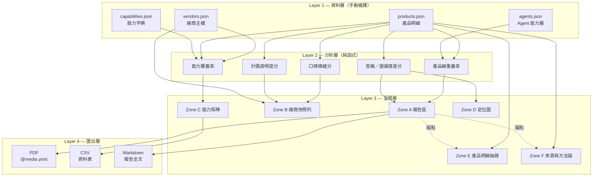
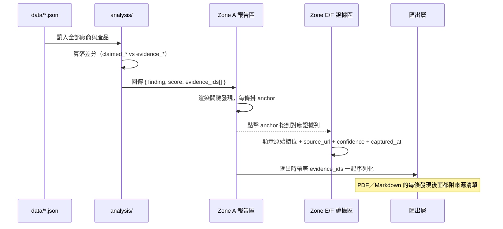

# 架構文件

> 決策理由見 `prepare.md`（MC-002 形態、MC-003 技術選型、MC-004 資料契約）。
> 本檔只寫「長什麼樣、怎麼流」，不重複理由。

---

## 系統架構



**單向依賴**：L1 → L2 → L3 → L4，不得反向。呈現層不得自己算數字，
匯出層不得自己組資料——兩者都只能吃上一層的輸出。

---

## 模組職責

| 層 | 模組 | 職責 | 明確不做 |
|---|------|------|---------|
| L1 | `data/*.json` | 唯一事實來源。每筆事實欄位帶三個中繼欄位 | 不做任何計算、不存衍生值 |
| L2 | `src/analysis/*.ts` | 純函式：吃 JSON 吐分數，無副作用、無 I/O | 不讀檔、不碰 DOM、不呼叫 API |
| L3 | `src/zones/*.tsx` | 版面與互動 | 不算分數（算了就會與匯出對不上） |
| L4 | `src/export/*.ts` | 三種格式的序列化 | 不重新查資料、不重算 |

**為什麼分析層要是純函式**：面試會被問「這個 0.5 分怎麼來的」。純函式可以單獨拿出來跑、
可以寫測試、可以逐行講給人聽；混進 React 元件裡的計算，講到一半就會開始翻檔案找。

---

## 資料模型

### `vendors.json`

```jsonc
{
  "id": "appier",
  "name": "Appier",
  "name_zh": "沛星互動科技",
  "ticker": "4180.T",
  "hq": "Taiwan",
  "positioning": "AI-native MarTech，橫跨廣告、互動、資料三個市場",
  "product_lines": ["advertising_cloud", "personalization_cloud", "data_cloud"],
  "metrics": {
    "revenue_latest": { "value": 12100000000, "currency": "JPY", "period": "FY26Q1", "yoy": 0.294,
                        "source_url": "...", "confidence": "verified", "captured_at": "2026-08-07" }
  }
}
```

### `products.json`（核心表）

```jsonc
{
  "id": "aiqua",
  "vendor_id": "appier",
  "name": "AIQUA",
  "line": "personalization_cloud",
  "category": "marketing_automation",
  "buyer_role": "CRM／會員行銷",

  "features": [ { "text": "AI 推薦（NLP＋深度影像學習＋興趣親和度）",
                  "source_url": "...", "confidence": "claimed", "captured_at": "2026-08-07" } ],

  "claimed_strengths": [ /* 廠商自己說的優勢 */ ],
  "evidence_reviews":  [ /* 第三方評論站可查證的正負面 */ ],

  "pricing":   { "model": "enterprise_quote", "public": false, "value": null,
                 "confidence": "none", "source_url": null, "captured_at": "2026-08-07" },
  "adoption":  { "customers": null, "reviews_count": null, "rating": null,
                 "confidence": "none", "note": "Appier 僅公開全產品加總數字，未分產品揭露" },

  "pain_points": [ { "text": "自家產品之間的資料互通性是評論中最一致的抱怨",
                     "type": "integration", "source_url": "...", "confidence": "verified" } ],
  "competitors": ["braze", "insider", "moengage", "clevertap", "bloomreach", "iterable"],

  "first_party_data_dependency": 4,   // 1–5
  "acquisition_difficulty": "medium"  // low | medium | high
}
```

### 三個中繼欄位（強制）

| 欄位 | 型別 | 說明 |
|------|------|------|
| `source_url` | string \| null | 可點開驗證的來源。`null` 只允許在 `confidence` 為 `none` 時出現 |
| `confidence` | enum | `verified` / `claimed` / `inferred` / `none`，四態封閉（← MC-004） |
| `captured_at` | string | ISO 日期。競品情報是快照，沒有日期的數字沒有意義 |

### `capabilities.json`（能力字典）

能力矩陣的欄位定義由這份檔決定，**不散落在元件裡**。每個能力有 `id`、`label`、`group`、
`definition`（判定標準的白話說明，Zone F 直接引用）。

格子的值同樣是四態：`full` / `partial` / `none` / `claimed_only`——
最後一個是本專案特有的：**廠商說有，但找不到第三方證據**。

---

## 資料流：一句結論怎麼連回它的證據



**關鍵設計**：`evidence_ids` 從分析層就跟著結論走，不是呈現層事後補的。
這樣匯出的 PDF 才會帶著來源，而不是只有一堆沒出處的斷言。

---

## 技術棧

| 項目 | 選型 | 為什麼不是別的 |
|------|------|--------------|
| 建置 | Vite + React + TypeScript | TS 是為了讓 `confidence` 四態變成編譯期約束，不是執行期才發現填錯 |
| 樣式 | CSS Modules + CSS 變數 | 匯出 PDF 要靠 `@media print` 覆寫，變數化的 token 才改得動 |
| 圖表 | 手寫 SVG | 需求只有散佈圖／長條／熱力矩陣三種（← MC-003） |
| 資料 | 靜態 JSON | 無後端、無 DB、無爬蟲（← MC-003） |
| 匯出 | `window.print()` ＋ 前端字串組裝 | 零依賴；不引入 jsPDF／html2canvas（產出的 PDF 是圖片，選不了字也搜不了） |
| 測試 | Vitest（僅測分析層） | 呈現層不寫測試——作品集專案的測試該用在「分數算得對不對」這種會被追問的地方 |

---

## 目錄結構（M1 落地後的樣子）

```
martech-competitor-dashboard/
├── data/                  # L1
├── src/
│   ├── analysis/          # L2 純函式，逐一對應一個指標
│   ├── zones/             # L3 Zone A–F
│   ├── export/            # L4 pdf.ts / csv.ts / markdown.ts
│   └── types/             # confidence 四態等共用型別
├── scripts/validate.js    # 資料契約檢查，CI 與 commit 前跑
└── docs/
```

---

## 未決事項

以下三項在 `prepare.md`「待討論事項」有正本，此處只列它們對架構的影響：

1. **落差分的評分規則** → 決定 `src/analysis/gap.ts` 的介面
2. **版本 diff 的基準（每月快照 vs 事件驅動）** → 決定要不要在 `data/` 下多一層日期目錄
3. **台灣在地那群資料不足時的處理** → 可能需要分群專屬的 `capabilities` 子集
